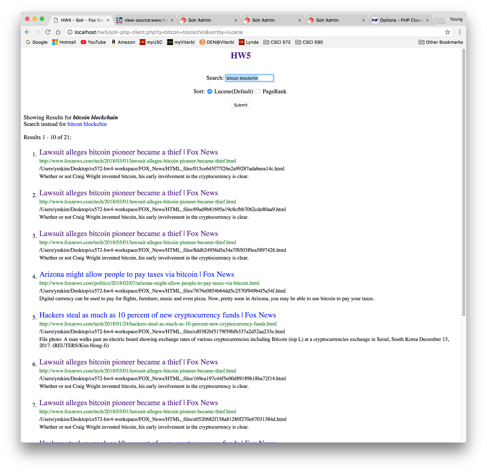
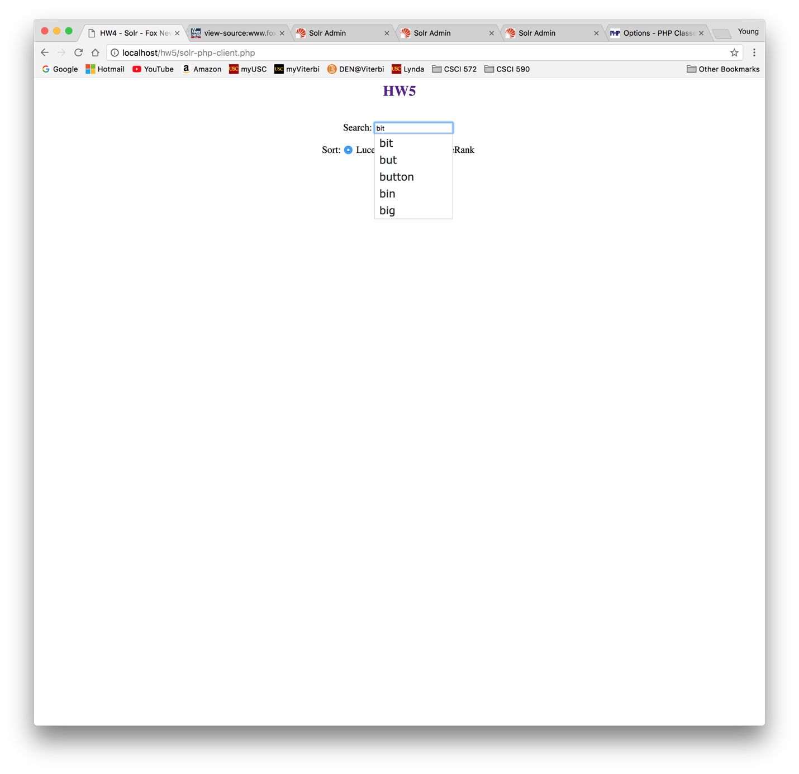

# solr-autocomplete

## Search Engine with Auto-complete using Solr
* add spell checking, autocomplete/suggest, snippet to hw4
* spelling checking using third-party program that implements Norvig's algorithm in php
* autocomplete using Solr-Lucene's suggest feature
* snippet (basic) find first sentence containing query term

### HtmlParse.java
* using Apache Tika as parser
* concat body content of html files collected from (Fox News) to create big.txt file
* big.txt file used for SpellCorrector.php (third-party containing Norvig's algorithm)

### solr-php-client.php (* messy code, but should work for in-class demo)
* added Spelling Correction, Autocomplete/Suggestion, and Snippet
* spelling correction using third-party program that implements Norvig's algorithm in php
* autocomplete/suggestion functionality added from Solr/Lucene feature
* snippets will try to find first sentence containing query term (basic)
* code ref: https://github.com/PTCInc/solr-php-client

### SpellCorrector.php can be found below
* code ref: http://www.phpclasses.org/package/4859-PHP-Suggest-corrected-spelling-text-in-pure-PHP.html#download

### example of spell correction

### example of autocomplete
